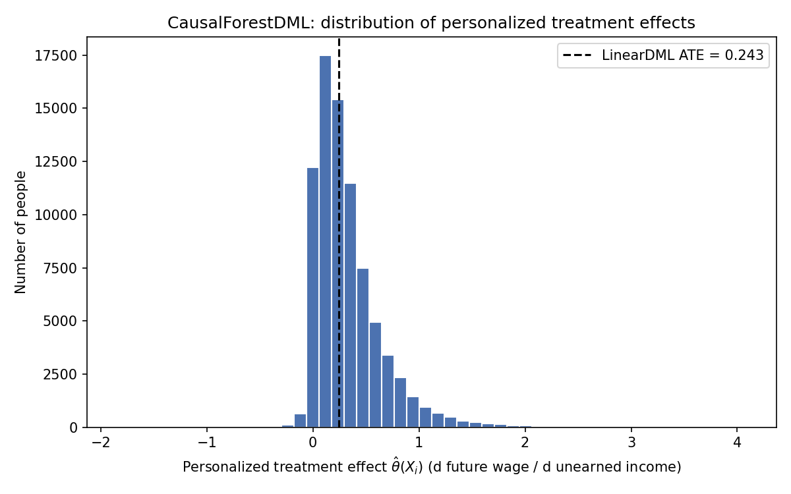

# UBI Labor Supply DML

Estimates the causal effect of unconditional cash / unearned income on future
labor income using longitudinal IPUMS CPS ASEC microdata and Double Machine
Learning (DML), then simulates a $6,000/year UBI against the fitted effect.

## Research design

- **Outcome (Y)**: `INCWAGE` in year T+1 — wage and salary income the year
  *after* treatment is measured.
- **Treatment (T)**: `INCINT + INCDIVID + INCRENT + INCRETIR + INCOTHER` in
  year T — a proxy for unconditional/unearned cash income.
- **Confounders (X)**: `AGE, SEX, RACE, MARST, EDUC, NUMPREC, NCHILD, METRO,
  IND`, all measured in year T (never T+1, to avoid leakage).
- **Weights**: `ASECWT` (year T).
- **Sample**: working-age adults (18–64) in year T, restricted to the
  person-year pairs IPUMS could successfully match across two adjacent ASEC
  waves.

Treatment and confounders are strictly baseline (year T); the outcome is
strictly follow-up (year T+1). Y is never used to construct T or X.

## Methodology: Double Machine Learning

A naive regression of `INCWAGE_2` on `T` and raw confounders lets any
misspecification in the outcome/treatment model leak directly into the
coefficient on `T` — a real risk here since the confounder-outcome
relationship (age, education, industry, family structure vs. wages) is
highly nonlinear.

DML (Chernozhukov et al., 2018) fixes this via **Neyman-orthogonal
partialling-out**: it fits `E[Y|X]` and `E[T|X]` separately with flexible ML
models (here, `XGBRegressor`), takes the residuals from both, and estimates
the causal coefficient by regressing residual-Y on residual-T. That moment
condition's derivative with respect to small nuisance-model errors is zero,
so first-order mistakes in the two XGBoost models don't bias the causal
estimate — only errors that survive cross-fitting (`cv`-fold sample
splitting between nuisance fitting and effect estimation) can. This is what
lets a regularized, biased learner like gradient-boosted trees still produce
a root-n consistent estimate of the treatment effect.

Two estimators are fit:

| Estimator | Gives you | Where |
|---|---|---|
| `LinearDML` | A single average effect β (constant across everyone) | [`ubi_dml/dml_pipeline.py`](ubi_dml/dml_pipeline.py) |
| `CausalForestDML` | Per-person effects θ(Xᵢ) — how the effect varies by age, education, industry, etc. | same file |

## Important caveat on interpretation

β comes out **positive** and statistically significant in this data: people
with more unearned income in year T tend to earn *more* wage income in year
T+1, not less. This is not a bug — CPS ASEC's unearned-income variables are
dominated by capital/asset income and pensions, which correlate with
unobserved wealth, career stability, and earning capacity that aren't in the
confounder set (CPS collects no net worth or asset data). DML only
orthogonalizes against the `X` it's given; it cannot correct for confounders
that were never measured. Treat β as descriptive of "how existing
asset-holders' wages evolve," not as the effect a randomized UBI experiment
would produce — a real randomized cash transfer, uncorrelated with existing
wealth, would plausibly show a different (and quite possibly negative) sign.

## Data setup

This repo does **not** include an IPUMS extract — IPUMS's terms of use
prohibit redistributing microdata, so you need to pull your own:

1. Go to [IPUMS CPS](https://cps.ipums.org/cps/) and build a **linked
   (longitudinal) extract** spanning at least two adjacent ASEC years,
   selecting: `CPSIDP, YEAR, ASECWT, AGE, SEX, RACE, MARST, EDUC, NUMPREC,
   NCHILD, METRO, IND, INCWAGE, INCINT, INCDIVID, INCRENT, INCRETIR,
   INCOTHER`.
2. Download in **fixed-width (.dat.gz)** format and request the accompanying
   **DDI codebook (.xml)** — the pipeline parses column positions directly
   from that codebook, since fixed-width layouts aren't stable across
   extracts.
3. Place both files in the repo root (e.g. `cps_00001.dat`, `cps_00001.xml`).

If your extract is *not* pre-linked (a plain multi-year pull rather than
IPUMS's longitudinal linking tool), use
[`ubi_dml/panel.py`](ubi_dml/panel.py)'s `build_longitudinal_panel()` to
merge person-years into T/T+1 pairs on `CPSIDP` before running the rest of
the pipeline — see that module's docstring for the CPSIDP-matching caveats
it guards against.

Please cite IPUMS in any published use of this data:
> Sarah Flood, Miriam King, Renae Rodgers, Steven Ruggles, J. Robert Warren,
> Daniel Backman, Annie Chen, Grace Cooper, Stephanie Richards, Megan
> Schouweiler, and Michael Westberry. IPUMS CPS: Version 12.0 [dataset].
> Minneapolis, MN: IPUMS, 2024. https://doi.org/10.18128/D030.V12.0

## Installation

```bash
python3 -m venv .venv
source .venv/bin/activate
pip install -r requirements.txt
```

`xgboost` needs the OpenMP runtime on macOS:

```bash
brew install libomp
```

## Usage

```bash
python run_pipeline.py --dat cps_00001.dat --xml cps_00001.xml
```

Options:

| Flag | Default | Description |
|---|---|---|
| `--dat` | `cps_00001.dat` | Path to the fixed-width extract |
| `--xml` | `cps_00001.xml` | Path to the DDI codebook |
| `--cv` | `5` | Cross-fitting folds for DML |
| `--random-state` | `0` | Seed |
| `--cate-hist-out` | `cate_histogram.png` | Where to save the CATE histogram |
| `--skip-causal-forest` | off | Skip the (slower) heterogeneous-effects forest |

## Project structure

```
ubi_dml/
  ddi_parser.py        DDI XML -> fixed-width column spec
  preprocessing.py     Missing-code cleaning, sample restriction, treatment construction
  panel.py             Generic CPSIDP long-format T -> T+1 merge (for non-linked extracts)
  dml_pipeline.py       LinearDML + CausalForestDML, XGBRegressor nuisance models
  policy_simulation.py  $6,000/year UBI simulation from the fitted beta
run_pipeline.py          CLI entry point
requirements.txt
```

## Example output

From an 80,412-person analytic sample (2022→2023, 2023→2024, 2024→2025 linked cohorts):

```
beta (d wage_t+1 / d unearned_income_t): 0.2431
stderr: 0.0390   95% CI: [0.1670, 0.3190]

Policy simulation: $6,000/year UBI
Predicted change in next-year wage income: $1,458.56 (95% CI: [$1,002.00, $1,914.00])

CATE summary across 80,412 people:
  mean=0.3249  median=0.2447  std=0.3288  [-1.8327, 4.0716]
```


