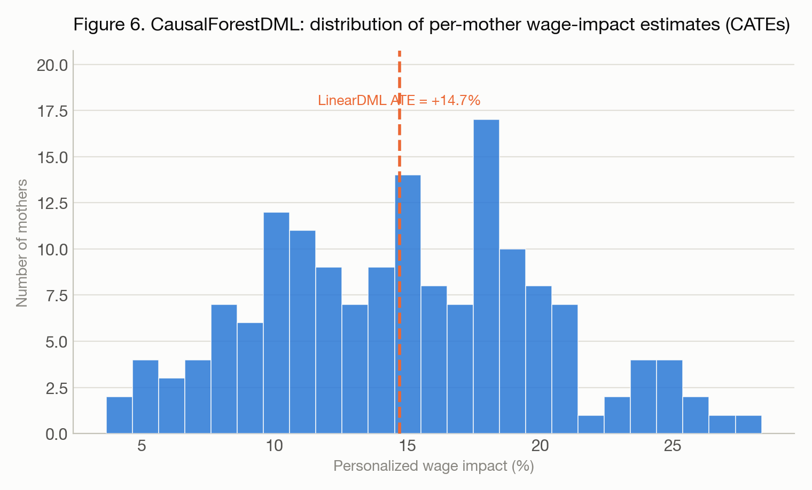

# BFY Cash Transfer -> Wages DML

Estimates the causal effect of Baby's First Years (BFY, ICPSR 37871)'s
unconditional cash transfer on maternal log hourly wages using Double
Machine Learning (DML), with `LinearDML` for the average treatment effect
and `CausalForestDML` for heterogeneous (per-mother) effects.

## Research design

- **Treatment (T)**: `TREATA0` — binary RCT arm assignment (1 = high-cash
  arm, \$333/month; 0 = low-cash arm, \$20/month), randomized at baseline.
- **Outcome (Y)**: `ln(HOURLY_WAGE)`, where
  `HOURLY_WAGE = HHMOMEARNEDA1 / (MHWEEKTOTALA1 * 52)` — mother's generated
  (inflation-adjusted) earned income for the prior calendar year, divided by
  current weekly hours annualized at 52 weeks — measured at the Year-1
  follow-up.
- **Confounders (X)**: `AGEA0, MRACEA0, MEDLEVELA0, MRELATESTATUSA0,
  HHCOMBINEDINCOMEA0, HHNADULTA0, HHNCHILDA0, SITEA0`, all measured at
  baseline (never post-treatment).
- **Sample**: mothers with positive Year-1 earnings, weekly hours in
  `[10, 80]`, and an implied hourly wage in `[$7.25, $250.00]` — see
  "Known limitation" below for why this restriction removes roughly half of
  employed respondents.

Because `T` is randomized, `T ⊥ X` (and every unobserved confounder,
including wealth) by design — a materially different identification story
from the observational CPS specification this project started from (see
"History" below). Baseline covariates are still fed into the DML nuisance
models, but only to reduce residual variance and sharpen the confidence
interval, not to buy identification the way they had to under the CPS
design.

## Methodology: Double Machine Learning with a discrete treatment

DML (Chernozhukov et al., 2018) partials out `X` from both `Y` and `T`
separately via **Neyman-orthogonal** nuisance models, then estimates the
causal coefficient from the residuals. Because `T` is binary here (RCT arm),
`E[T|X]` is a propensity score, so the treatment nuisance model is an
`XGBClassifier` (`discrete_treatment=True`, `objective='binary:logistic'`)
rather than a regressor; `E[Y|X]` uses an `XGBRegressor`. Cross-fitting
(`cv`-fold sample splitting between nuisance fitting and effect estimation)
still protects the estimate from nuisance-overfitting bias.

| Estimator | Gives you | Where |
|---|---|---|
| `LinearDML` | A single average treatment effect (ATE) | [`ubi_dml/dml_pipeline.py`](ubi_dml/dml_pipeline.py) |
| `CausalForestDML` | Per-mother effects (CATE) — how the effect varies by age, education, site, etc. | same file |

Both the raw effect on `ln(hourly wage)` and the percentage wage impact
(`(exp(beta) - 1) * 100`) are reported — see
[`ubi_dml/policy_simulation.py`](ubi_dml/policy_simulation.py). Because `T`
is a binary arm assignment rather than a continuous dollar amount, there is
no marginal-dollar slope to rescale by a hypothetical grant size the way the
CPS specification's policy simulation did; the percentage wage impact is
the causal effect of *being assigned to the high-cash arm*, full stop.

## Known limitation: retrospective earnings vs. point-in-time hours

`HHMOMEARNEDA1` covers the **entire prior calendar year**; `MHWEEKTOTALA1`
is hours worked **at the time of the Year-1 interview**. These are only
mutually consistent for a mother who worked the same hours all year — a
poor assumption for a population surveyed within roughly a year of
childbirth, many of whom spent part of the recall window on unpaid
postpartum leave before returning to work. Empirically, median implied
hourly wage *falls* as current weekly hours *rise* (~\$18/hr under 10
hrs/week down to ~\$5/hr at 40+ hrs/week) — the opposite pattern from what a
simple low-hours-inflates-the-rate story would predict, and consistent
instead with heterogeneous return-to-work timing during an infant's first
year understating the hourly rate for mothers who returned to work later in
the recall period.

There is no weeks-worked-during-the-recall-window field in this extract to
correct this directly (`MTOTALMONTHSWORKA1` is months worked *since the
child's birth*, a different, non-comparable window — checked and rejected
as a substitute). `preprocessing.py`'s `MIN_HOURLY_WAGE`/`MAX_HOURLY_WAGE`
and `MIN_WEEKLY_HOURS`/`MAX_WEEKLY_HOURS` bounds absorb the resulting noise
rather than eliminate it: the \$7.25 wage floor alone drops roughly half of
otherwise-employed respondents. Treat the reported effect as an estimate
bounded around this measurement limitation, not a precise point estimate —
see `summarize_wage_by_arm()`'s printed output for the distribution this
restriction is drawn from. Checked and cleared, though: the hours- and
wage-band filters themselves exclude employed mothers at nearly identical
rates by arm (~74% either way), so they are not an additional source of
differential selection on top of the measurement issue itself.

## Differential item non-response, corrected via IPW

Mothers do not answer the Year-1 earnings question (`HHMOMEARNEDA1`) at the
same rate by arm: **9.8% missing in the low-cash arm vs. 4.3% in the
high-cash arm** (two-proportion z-test: z=2.84, p=0.0045). This sits
*upstream* of the employment check below — that check can only compare
employment rates among mothers who answered the question, so it can't see
this on its own. If non-response correlates with true (unobserved) wages
differently by arm — plausible, since financially unstable mothers with
informal/irregular income are the ones most likely to find the question
hard to answer, and the two arms differ by design in financial stability —
this is a differential-nonresponse threat to internal validity that DML's
orthogonality cannot fix, since it's a sample-construction problem upstream
of estimation.

That's not the only non-response channel the wage sample depends on, though:
constructing `HOURLY_WAGE` also needs the Year-1 hours question
(`MHWEEKTOTALA1`), which has its *own*, separate non-response — missing for
19.7% of earnings-responders (14.7% low-cash vs. 16.9% high-cash among
employed responders; not significant on its own at this sample size, but an
earnings-only correction would have no way of ever detecting or correcting
for it). An earnings-only response weight would leave mothers who answer
the earnings question but not the hours question just as unrepresented as
uncorrected earnings non-responders — the same class of problem, just on a
second field.

The fix: `preprocessing.prepare_response_sample()` builds the full baseline-
complete sample *including* non-responders, and computes two response
indicators — `RESPONDED` (earnings question answered) and `WAGE_RESPONDED`
(earnings *and* hours both answered). `dml_pipeline.fit_response_weights()`
fits two independent cross-fitted `XGBClassifier`s — `P(RESPONDED=1 | X, T)`
and `P(WAGE_RESPONDED=1 | X, T)` (T is included as a feature in both, since
response differs by arm) — and converts each into its own inverse-
probability-of-response weight (`RESPONSE_WEIGHT`, `WAGE_RESPONSE_WEIGHT`,
each Hájek-normalized to mean 1 among its own responders) via
`preprocessing.attach_response_weights()`. Mothers whose covariate/arm
combination under-responds get upweighted, standing in for the similar
non-responders missing from the analytic sample.
`build_employment_sample()` carries `RESPONSE_WEIGHT` through (it only needs
earnings), `clean()` carries `WAGE_RESPONSE_WEIGHT` through (it needs both
fields), and `fit_employment_dml()` / `fit_linear_dml()`+`fit_causal_forest_dml()`
each pass the matching weight as `sample_weight` — every reported effect is
weighted for the non-response event that actually determines its sample,
not estimated on the (non-randomly incomplete) complete-case subset.
Concretely, this narrows the unweighted-vs-weighted gap in mean
`HOURLY_WAGE` between arms (see `summarize_wage_by_arm()`'s printed weighted
mean) and moves the `LinearDML` ATE from +13.9% to +14.7% wage impact — the
expected, honest effect of correcting a real bias, not a sign the fix
"worked" in the sense of confirming a preferred answer.

## Extensive-margin (employment) check

Restricting the wage sample to employed mothers conditions on a
post-treatment outcome, which could bias the wage ATE if the cash transfer
itself changed who is employed. `preprocessing.build_employment_sample()`
builds the *unrestricted* (but still response-weighted) sample (includes
mothers with `EMPLOYED=0`), and `dml_pipeline.fit_employment_dml()`
estimates treatment's effect on `P(employed)` via response-weighted DML. In
this data, employment rates are statistically indistinguishable between
arms (~69% in both, among responders), so this run does not show evidence
of extensive-margin selection *conditional on response* — but combined with
the item-non-response correction above, the wage ATE should still be read
as conditional-on-employment, not as an unconditional effect on wages for
the full randomized population.

## Data setup

This repo does **not** include the ICPSR extract — ICPSR's terms of use
prohibit redistributing restricted-use microdata, so you need to pull your
own:

1. Request access to [Baby's First Years, ICPSR 37871](https://www.icpsr.umich.edu/web/ICPSR/studies/37871)
   (restricted-use application required).
2. Download **DS0001** (baseline/`A0` wave) and **DS0002** (Year-1
   follow-up/`A1` wave) in delimited (`.tsv`/`.csv`) or Stata (`.dta`)
   format. The two waves are separate files joined on `PUBLICSAMPLEID` —
   there is no single file containing both `TREATA0` and the Year-1
   earnings/hours fields.
3. Place them anywhere and point `--baseline`/`--followup` at them (see
   Usage below), e.g.:
   ```
   Data/ICPSR_37871/DS0001/37871-0001-Data.tsv
   Data/ICPSR_37871/DS0002/37871-0002-Data.tsv
   ```

Please cite ICPSR/the BFY study team in any published use of this data per
the terms of your data use agreement.

## Installation

```bash
python3 -m venv .venv
source .venv/bin/activate
pip install -r requirements.txt
```

`xgboost` needs the OpenMP runtime on macOS:

```bash
brew install libomp
```

## Usage

```bash
python run_pipeline.py \
    --baseline Data/ICPSR_37871/DS0001/37871-0001-Data.tsv \
    --followup Data/ICPSR_37871/DS0002/37871-0002-Data.tsv
```

Options:

| Flag | Default | Description |
|---|---|---|
| `--baseline` | `Data/ICPSR_37871/DS0001/37871-0001-Data.tsv` | Path to the DS0001 baseline file (`.dta`/`.csv`/`.tsv`/`.tab`) |
| `--followup` | `Data/ICPSR_37871/DS0002/37871-0002-Data.tsv` | Path to the DS0002 Year-1 follow-up file (`.dta`/`.csv`/`.tsv`/`.tab`) |
| `--cv` | `5` | Cross-fitting folds for DML |
| `--random-state` | `0` | Seed |
| `--cate-hist-out` | `cate_histogram.png` | Where to save the CATE histogram |
| `--skip-causal-forest` | off | Skip the (slower) heterogeneous-effects forest |

The run prints, in order: the baseline-complete sample size, the Year-1
earnings-question response rate by arm and the earnings-AND-hours
`WAGE_RESPONDED` rate by arm, the wage-analytic sample size and its
`HOURLY_WAGE` distribution by arm (unweighted and response-weighted), the
employment-analytic sample size and employment rate by arm, the
extensive-margin employment-effect check, the `LinearDML` ATE, and (unless
skipped) the `CausalForestDML` ATE and CATE distribution.

## Project structure

```
ubi_dml/
  preprocessing.py       Load DS0001+DS0002, missing-code cleaning, response-
                          sample construction, wage/employment sample
                          construction, diagnostics
  dml_pipeline.py         LinearDML + CausalForestDML (discrete treatment),
                          XGBClassifier treatment propensity + XGBRegressor
                          outcome, extensive-margin employment DML, and the
                          response-propensity model for IPW non-response
                          correction
  policy_simulation.py    Formats the ATE as a percentage wage impact
  ddi_parser.py           Unused: IPUMS CPS DDI XML parser from the prior
                          observational-data specification (see History)
  panel.py                Unused: generic CPSIDP long-format T/T+1 merge,
                          also from the prior CPS specification
run_pipeline.py            CLI entry point
requirements.txt
```

`ddi_parser.py` and `panel.py` are IPUMS-CPS-specific and not used by the
current BFY pipeline; they're left in place only because they're harmless
dead code from before the pivot described below, not because anything here
depends on them.

## History: pivot from an observational CPS specification

This project originally estimated the effect of unearned/asset income on
future wages using observational IPUMS CPS ASEC data. That specification's
positive, significant coefficient (`beta ≈ 0.243`, 95% CI `[0.167, 0.319]`,
`n = 80,412`) reflected omitted-variable bias from unobserved wealth — CPS
collects no net worth data, so DML's orthogonality could partial out the
confounders it was given but not the wealth it was never given. The project
pivoted to the BFY RCT specifically to fix this at the design stage: random
assignment makes `T ⊥ X` (and every unobserved confounder) true by
construction, which an observational design can never guarantee no matter
how flexible the nuisance models are.

## Example output

From the `n=160` wage-analytic sample (66 high-cash, 94 low-cash mothers),
response-weighted:

```
=== Year-1 earnings-question RESPONDED rate by treatment arm ===
             mean  sum  count
TREATA0
0        0.901861  533    591
1        0.956522  374    391

=== Year-1 earnings-AND-hours WAGE_RESPONDED rate by treatment arm ===
             mean  sum  count
TREATA0
0        0.734349  434    591
1        0.751918  294    391

Response-weighted mean HOURLY_WAGE by arm:
TREATA0
0    13.319383
1    13.643955

=== EMPLOYED rate by treatment arm (employment-analytic sample) ===
             mean  sum  count
TREATA0
0        0.688555  367    533
1        0.681818  255    374

=== Effect of treatment on P(employed) ===
beta (probability points): -0.0208 (stderr 0.0310, 95% CI [-0.0820, +0.0400])

=== Average treatment effect (LinearDML) ===
Average treatment effect on ln(hourly wage): 0.1372 (stderr 0.0730, 95% CI [-0.0050, 0.2800])
Percentage wage impact of the BFY high-cash arm: +14.71% (95% CI [-0.50%, +32.31%])

=== Average treatment effect (CausalForestDML) ===
Average treatment effect on ln(hourly wage): 0.1385 (stderr 0.0941, 95% CI [-0.0459, 0.3229])
Percentage wage impact of the BFY high-cash arm: +14.85% (95% CI [-4.49%, +38.12%])

CATE summary across 160 mothers (percentage wage impact):
  mean=14.97%  median=15.03%  std=5.25%  [3.67%, 28.34%]
```



Weighting for both non-response channels (not just earnings-question
non-response) moves the `LinearDML` ATE from +13.92% (earnings-only
weighting) to +14.71% here, and the CI shifts from barely excluding zero
([-1.29%, +31.39%]) to just barely including it ([-0.50%, +32.31%]) — a
small, honest correction, not a free precision gain. Given the sample size
and the earnings/hours measurement limitation described above, treat this
CI and the causal forest's CATEs as suggestive rather than precise.
